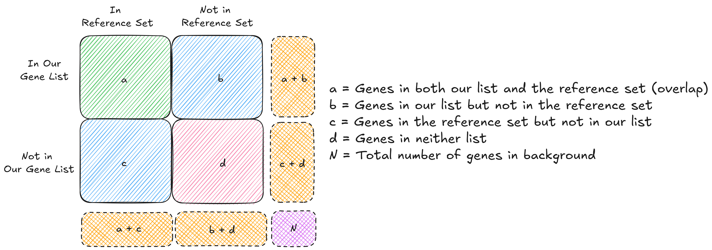

+++
title = "Clustermolepy"
date = "2025-04-05T12:49:40+05:30"
math = true

#
# description is optional
#
# description = "An optional description for SEO. If not provided, an automatically created summary will be used."

tags = ["single-cell", "python"]
+++

If you've worked with single cell data, there is always one random cluster that refuses to be annotated. Which usually ends up being a non-trival process of digging through bunch of cell type marker databases and publications, while trying to maintain mental sanity. When I came across the clustermole R package by Igor Dolgalev[add link], I was pleasently surprised at it effectiveness and simplicity. The only issue is that python has been my go to daily driver for most of tasks which also includes single cell analysis, I did the only logical thing anyone would; spend my next few weekends writing `clustermolepy`.

## Example Usage

Now, `clustermolepy` isn't ment to be a automated cell type annotation tool, but a quick way to explore enrichment of marker genes from different annotation databases. Here's an example of the main usecase, we'll be using the pbmc3k dataset from scanpy for this following example:

**Code:**
```python
# Loading Enricher module from clustermolepy along with scanpy
from clustermolepy.enrichr import Enrichr
import scanpy as sc

# Reading the pbmc3k data
adata = sc.datasets.pbmc3k_processed()

# Running the leiden clustering on adata
sc.tl.leiden(adata, flavor='igraph', n_iterations=2, resolution=0.8)

# Plotting the UMAP plots with orginal cell types present in the louvain column
# the newly assigned cluster ids are present in the leiden column
sc.pl.umap(adata, color=['louvain', 'leiden'], legend_loc='on data', save="pbmc3k_leiden.png")
```


**Ouput:**


### Identify Cluster DE Gene for Enricher

We need to identify marker genes for each Leiden cluster. We'll use Scanpy's `rank_genes_groups` function to perform differential gene expression and find genes that are upregulated in each cluster compared to the others clustermolepy provides a wrapper around Enrichr API to find enrichment of genes in gene sets

We will start with the B cells, which is a well defined population in pbmc3k dataset. Using `scanpy.rank_gene_groups` we can identifity the top 25 up-regulated genes in each cluster

**Code:**
```python
sc.tl.rank_genes_groups(adata, 'leiden', method='wilcoxon', use_raw=False)

# Let's extract the top N marker genes per cluster (e.g., top 25)
top_n_markers = 25
b_cell_markers = sc.get.rank_genes_groups_df(adata, '1').head(top_n_markers).names # The Leiden Cluster 1 corresponds to B cells
print(f"Cluster Marker Genes (Top {top_n_markers} cluster_1 / B cells markers):")
print(b_cell_markers)
```


**Output:**
```
Cluster Marker Genes (Top 25 cluster_1 / B cells markers):
0     HLA-DQA1
1        CD79A
2     HLA-DPB1
3     HLA-DRB1
4     HLA-DQB1
5        CD79B
6     HLA-DPA1
7         CD37
8        MS4A1
9      HLA-DMA
10       TCL1A
11     HLA-DMB
12      SMIM14
13        MZB1
14         LTB
15        PLD4
16         IGJ
17        EAF2
18        CD1C
19      RABEP2
20    TNFRSF17
21     RPL22L1
22        IRF8
23       CEPT1
24        NT5C
Name: names, dtype: object
```
### Using the Enrichr Module for querying Enrichr libraries
Now that we have our list of marker genes for each Leiden cluster, we can use `clustermolepy`'s built-in `Enrichr` module to directly query the Enrichr API! This makes it super easy to get biological insights from our marker genes.

`clustermolepy` provides the `get_cell_type_enrichment()` method!  This handy function simplifies the process by automatically querying a curated set of Enrichr libraries that are specifically relevant for cell type identification.

Under the hood, `get_cell_type_enrichment()` is multi-threaded, making it efficient forquerying multiple gene sets efficently.  It automatically checks your marker genes against these ten key gene set libraries:

```
* CellMarker_2024
* CellMarker_Augmented_2021
* Descartes_Cell_Types_and_Tissue_2021
* PanglaoDB_Augmented_2021
* Azimuth_Cell_Types_2021
* Azimuth_2023
* Tabula_Sapiens
* Human_Gene_Atlas
* Tabula_Muris
* Mouse_Gene_Atlas
```

Using `get_cell_type_enrichment()` is incredibly straightforward.  Using this with our Leiden Cluster 1 marker genes:

**Code:**
```python
enrichr = Enrichr(list(b_cell_markers), adj_pval_cutoff=0.05)
enrichr.get_cell_type_enrichment().head()
```

**Output**:

```
             term name       p-value   odds ratio  combined score                                                                                    overlapping genes  adjusted p-value  old p-value  old adjusted p-value                   gene_set
0        B cell:Kidney  5.086026e-18   103.437309     4118.877258  [SMIM14, EAF2, CD79B, CD79A, TCL1A, RABEP2, MZB1, TNFRSF17, IRF8, CD37, RPL22L1, LTB, CEPT1, MS4A1]      8.544523e-16            0                     0  CellMarker_Augmented_2021
1  B Cell Kidney Human  4.980387e-18   103.601072     4127.572795  [SMIM14, EAF2, CD79B, CD79A, TCL1A, RABEP2, MZB1, TNFRSF17, IRF8, CD37, RPL22L1, LTB, CEPT1, MS4A1]      9.213717e-16            0                     0            CellMarker_2024
2    B Cell Lung Human  1.924020e-16  1664.666667    60239.200656                                                         [CD79B, CD79A, TCL1A, MZB1, TNFRSF17, MS4A1]      1.779719e-14            0                     0            CellMarker_2024
3        B Cells Naive  2.872640e-15   139.718310     4678.264291                                            [CD79B, CD79A, TCL1A, EAF2, IRF8, CD37, LTB, CD1C, MS4A1]      2.872640e-14            0                     0   PanglaoDB_Augmented_2021
4       B Cells Memory  2.244502e-15   143.797101     4850.318315                                        [CD79B, CD79A, TCL1A, TNFRSF17, IRF8, CD37, LTB, CD1C, MS4A1]      2.872640e-14            0                     0   PanglaoDB_Augmented_2021
```
---

## How Does Enrichment Work?

Before we wrap up, it’s worth briefly mentioning how the enrichment is actually calculated under the hood. At the core of this is a statistical test that checks whether your list of marker genes overlaps with known cell type–specific gene sets more than you'd expect by random chance.

This is done using something called a Fisher’s exact test, which builds a simple 2×2 table like this:



From this table, Fisher's Exact Test is used to calculate a p-value — basically asking: If I randomly picked genes, what's the chance I’d see this much overlap?

Here's the formula behind it:

$$
p = \frac{{\binom{a + b}{a} \binom{c + d}{c}}}{{\binom{N}{a + c}}}
$$


\[
\begin{aligned}
KL(\hat{y} || y) &= \sum_{c=1}^{M}\hat{y}_c \log{\frac{\hat{y}_c}{y_c}} \\
JS(\hat{y} || y) &= \frac{1}{2}(KL(y||\frac{y+\hat{y}}{2}) + KL(\hat{y}||\frac{y+\hat{y}}{2}))
\end{aligned}
\]
